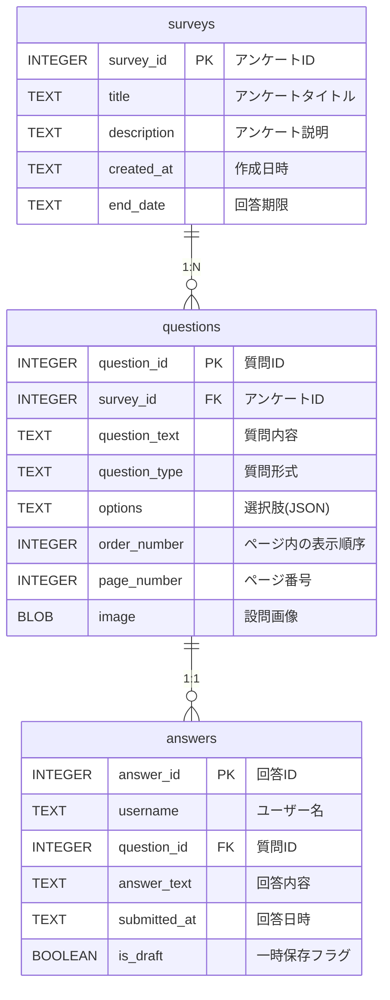

# アンケート回答アプリケーションの仕様

## アプリケーションの目的

ユーザーがアンケートに回答できる。
管理者がアンケートを作成、編集、削除できる。
回答状況を管理・確認できる。

## 主要な技術スタック

フレームワーク: Streamlit
データベース: SQLite3
認証: Keycloak(ユーザー識別のために採用)

## ユーザーとロール

* 一般ユーザー
  * アンケートの閲覧、回答（一時保存、提出）。
  * 自分の回答状況（未回答、一時保存中、回答済み）の確認。
* 管理者ユーザー
  *  一般ユーザーの全機能。
  * アンケートの作成、編集、削除、複製。
  * 質問の追加、編集、削除。
  * 回答結果の確認。
* 認証はkeycloakでOIDCにする
  * 管理者は`/survey_admin`グループに属しているユーザーのみ。

## データベーススキーマ (survey_app.db)

ユーザー情報は keycloak側で管理するので、データベースにユーザーテーブルは不要。
usernameはkeycloak側で管理する。



##  アプリケーションの画面フローと機能

### ログイン画面
st.login()を使用してログイン。

### メインナビゲーション
sidebarを使用して、メニュー項目を提供。
メニュー項目:
「ダッシュボード」（全ユーザー向けダッシュボード）
「回答ページ」（全ユーザー向けアンケート回答）
「管理者ページ」（管理者ユーザーのみ表示）

#### ユーザー名
ログイン中のユーザー名を表示。
ログアウトボタンを提供。

### ホームページ
ユーザーが自身のアンケート状況を一覧できるダッシュボード。
表示内容:
回答可能なアンケート: 未回答かつ回答期限内のアンケートリスト。
一時保存中のアンケート: 回答を途中で保存しているアンケートリスト。
回答済みのアンケート: すでに回答を提出済みのアンケートリスト。
各アンケートのエントリから、対応する回答ページへの遷移ボタンを提供。

### 回答ページ
ユーザーが選択したアンケートの質問を表示し、回答を入力・選択できる。
回答の一時保存 (is_draft = TRUE) と提出 (is_draft = FALSE) が可能。
回答済み/一時保存済みのアンケートは、その内容を読み込んで表示できる。

### 管理者ページ
管理者ユーザーのみアクセス可能。
サブメニュー:
「アンケート一覧」
「新規アンケート作成」
アンケート一覧:
既存のアンケートリストを表示。
各アンケートに対し、編集、削除、複製ボタンを提供。
編集ボタンクリックで、そのアンケートの質問管理画面に遷移。
新規アンケート作成:
アンケートのタイトル、説明、回答期限などを入力して新しいアンケートを作成。
質問管理画面 (アンケート編集時):
選択されたアンケートの質問リストを表示。
質問の追加、編集、削除機能。
質問タイプに応じた入力（テキスト、選択肢など）。
質問の順序、ページ番号、画像URLの設定。


## 

```sh
uv python pin 3.12
uv init .
uv venv
. .venv/bin/activate

uv add streamlit Authlib sqlalchemy aiosqlite
uv pip install streamlit-survey

# init
python app/database/init_db.py

# run
uv run streamlit run app/main.py --server.port 8501
```